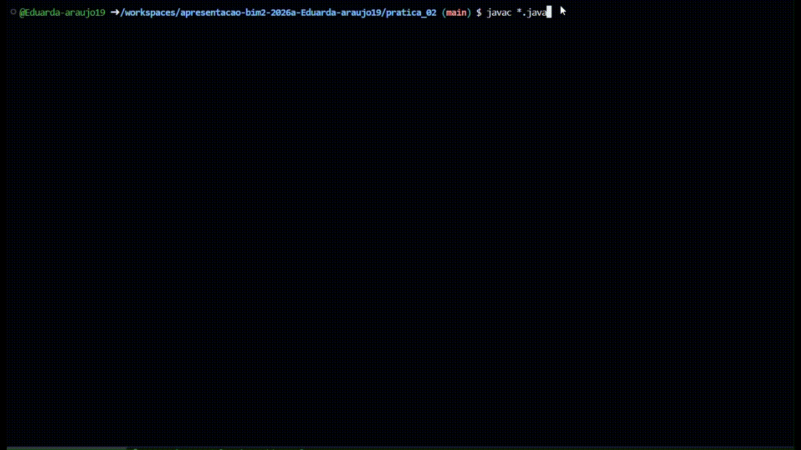
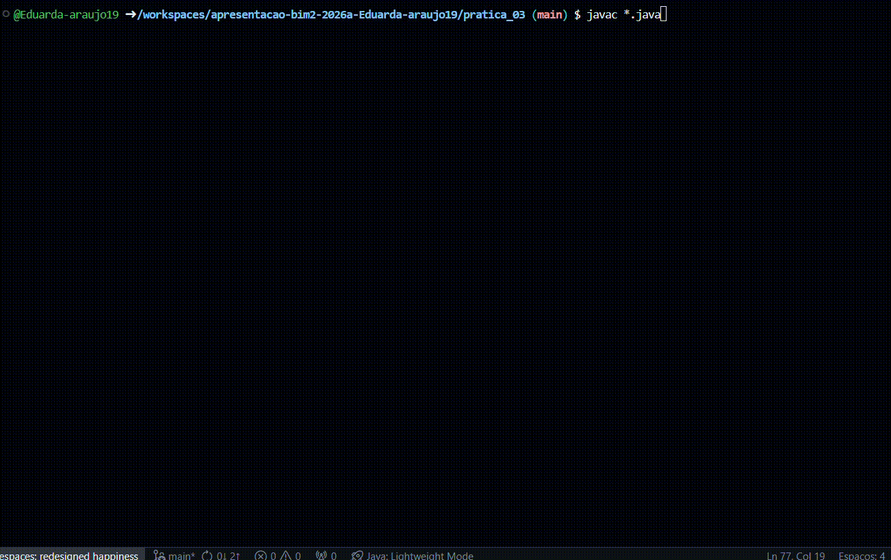

# apresentacao-bim2-2026a-Eduarda-araujo19

# Parte 1 : Realização dos exercícios da parte prática

### Exercício 1 : ThreadRace

Inicialmente, compilei e executei o código ThreadRace.java no codespace:


### Observação:
Ao executar 3 vezes o código, observei que o programa não seguia uma sequência constante na exibição de mensagens no terminal.
Como por exemplo na comparação da primeira e segunda execução em que suas últimas mensagens são, respectivamente:
"Donatello turtle finished the race!" e "Snowball rabbit finished the race!".Isso demonstrou o funcinamento da programção concorrete que tem como caracteristica o não-determinismo.

### Dúvidas:
Uma das minhas principais dúvidas foi entender a diferença entre "extends Thread" e "implements Runnable". Ao pesquisar e usar o auxilio da IA para comprender melhor o código, entendi que ao usar "extends Thread" a classe se torna uma Thread, herdando os seus métodos e atributos.Enquanto que ao utilizar "implements Runnable", a classe define somente o uso do método run() e precisa ser passada para um objeto Thread para rodar em paralelo.

----------------------------------------------------------------------------------------------
### Exercício 2 : AnotherThreadRace

Para esse exercício, criei uma nova classe Penguin derivada de Thread:

````java
class Penguin extends Thread {
    private String name;

    public Penguin(String name) {
		this.name = name;
	}

	private void runLikePenguin() {
		System.out.println(name + " is running fast");
	}

	public void run() {
		System.out.println(name + " penguin is at the start of the race!");
		for (int pos = 4; pos > 0; pos--) {
			runLikePenguin();
			System.out.println(name + " is at position " + pos);
		}
		System.out.println(name + " penguin finished the race!");
	}   
}
````

Também alterei a main para a execução da nova classe:

````java
class AnotherThreadRace {
	public static void main(String[] args) {
		Rabbit r = new Rabbit("Snowball");
		Thread t = new Thread(new Turtle("Donatello"));
        Penguin p = new Penguin("Eletro");
        
		r.start();
		t.start();
        p.start();
	}
}
````

### Compilação e Execução:
obs.: Diminui a distância da corrida( pos = 4) para melhor visualização.


------------------------------------------------------------------------------------------------------------------------------------------------------------
### Exercício 3 : BetterThreadRace


Para a construção da super-classe AnimalRuuner, eu utilizei o "implements Runnable" pois o uso de "extends Thread" geraria uma herança múltipla, algo que não é permitido em java:

````java
class AnimalRunner implements Runnable{
````

Após isso adicionei o atributo ````name```` que era comum entre os animais da corrida.Além disso, adicionei um novo atributo ````velocity````:
 ````java
    protected String name;
	protected String velocity;
````

Criei o método runlike() , agora com o atributo da velocidade do animal:
````java
protected void runLike(){
        System.out.println(name + " is running " + velocity);
    }
````

Alterei também o método run() , tornando-o mais génerico:
````java
public void run() {
		for (int pos = 4; pos > 0; pos--) {
			runLike();
			System.out.println(name + " is at position " + pos);
		}
	}
````

Para as classes dos animais apenas modifiquei as mensagens de inicio e fim da corrida:

````java
class Rabbit extends AnimalRunner {

	public Rabbit(String name,String velocity){
		super(name,velocity);
	}
	
	@Override
	public void run() {
		System.out.println(name + " rabbit is at the start of the race!");
		super.run();
		System.out.println(name + " rabbit finished the race!");
	}
}
````
### Compilação e Execução:



---------------------------------------------------------------------------------------------------------------------------------------------------------------
# Referências:

https://liascript.github.io/course/?https://raw.githubusercontent.com/AndreaInfUFSM/elc117-2026a/main/classes/26/README.md#1

https://youtu.be/Vd6nOALCYCc?si=aBb295MaKGy8k4Wj


